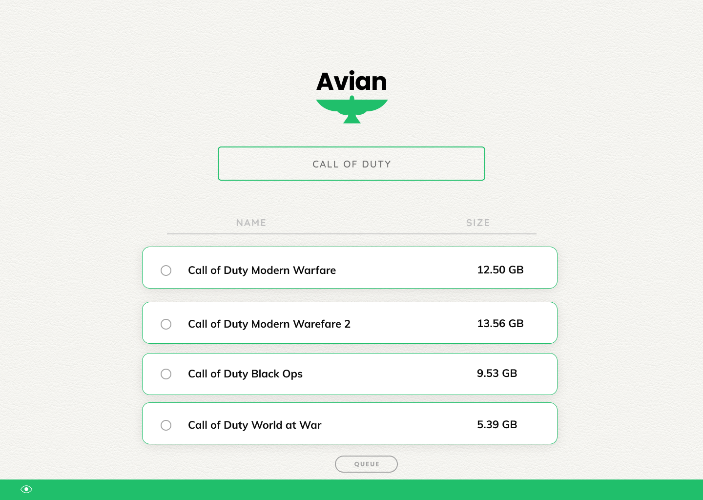
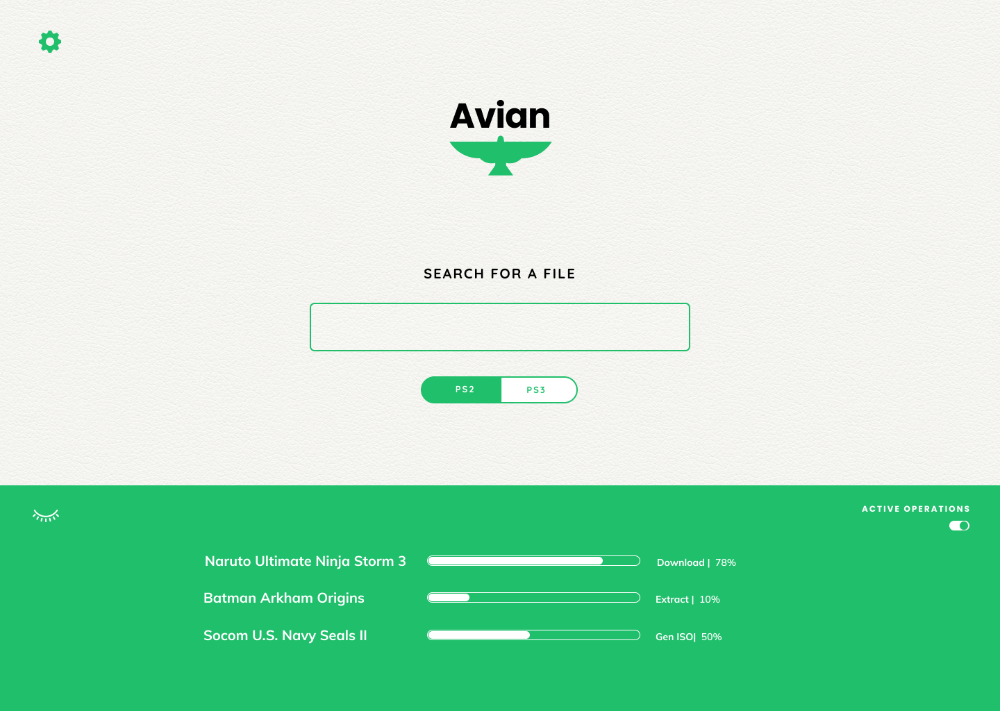
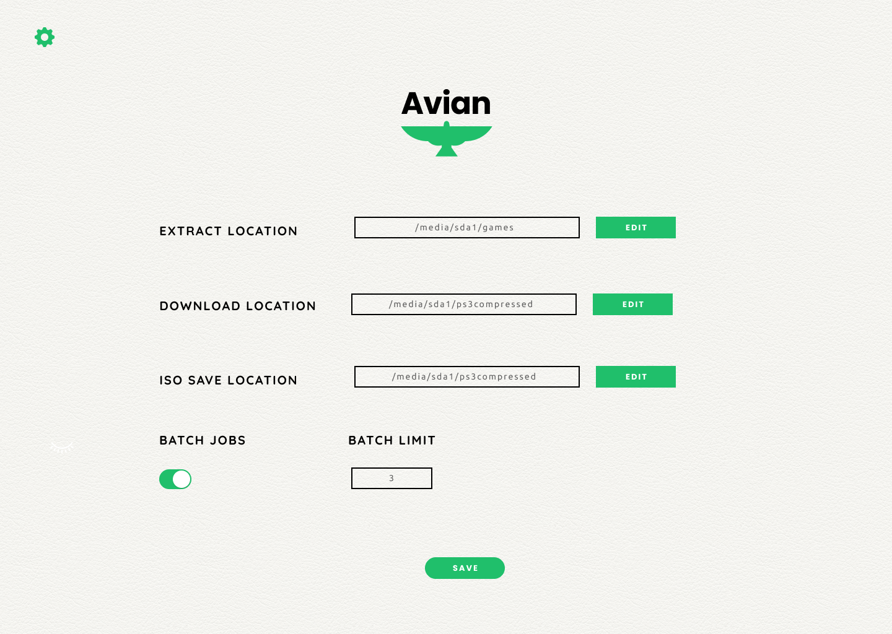

# Avian Download Manager
### Intended for theoretical use only.
Avian is a defunct project that aimed to serve as a download manager and ISO generator.

The goal was to run the frontend in a headless manner, sending requests the backend to queue downloads, extractions, and generate ISOs.

This project was ultimately abondoned when I realized that the list of ISOs desired was already exhausted, and therefore a tool to optimize such a process was no longer need.




### Backed by a JSON file, the front-end was fully capable of performing a live-search, selection, and deselection.

Here is some of the code that did the heavy lifting.

``` 
    handleSearch = (e) =>{

        var resourceData = data;

        //Take list of files and then change the naming convention:

        resourceData.forEach((resource, index, array) =>{
            array[index].filename = resource.filename.replace(/_/g, ' ')
        })
        
        //Filter search results
        var filteredData = resourceData.filter(resource =>{
            if(resource.filename.toLowerCase().includes(e.target.value.toLowerCase())){
                return resource.filename;
            }
        })

    
        this.setState({resourceList: filteredData})
      
    }

```

### Download and Progress Tracking



### Settings

